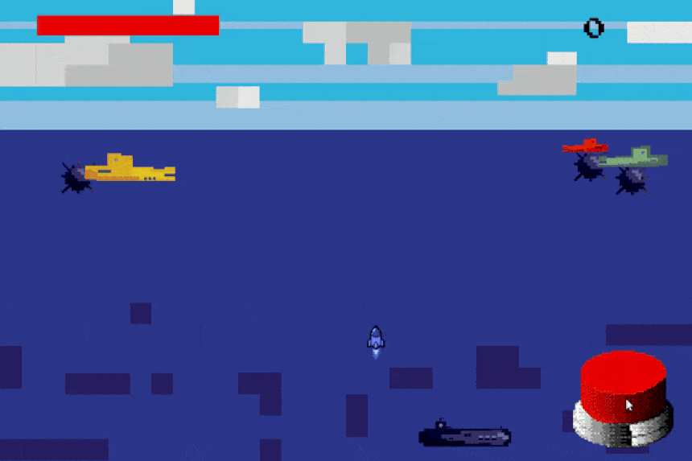

# Supermarine

Supermarine is a game where the primary goal is to gain as many points as possible by shooting enemy ships and falling naval mines. If the 
player (submarine) gets in contact with a naval mine then the player looses and the game is restarted.



The game was built using only Java and reactive streams (RxJava). The purpose for creating this game was to make entertaining examples of RxJava 
usage for my presentation which can be found [here](https://docs.google.com/presentation/d/1dkD8Wn8xN0Qe5KNJO_FcLLqMfCw3JoseutoXE0UIztk/edit?usp=sharing). 

## Start

```bash
./build-jar.sh && java -jar ./target/supermarine-1.0.jar
```
 
## Controls

- left/right arrow for moving
- clicking on the button for shooting

## Resources

- Graphics (except button and rocket) was made by me
- Sounds gained from [freesound](https://freesound.org/)
- Font in counter was made by CodeMan38 ([link](https://fonts.google.com/specimen/Press+Start+2P))